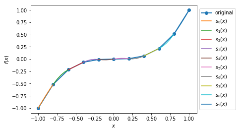
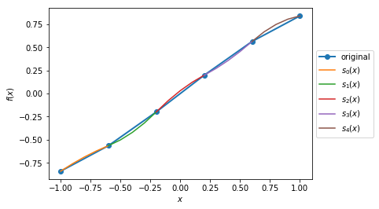
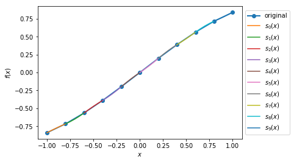
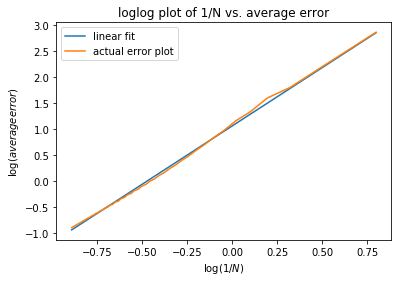
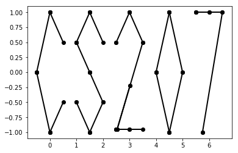
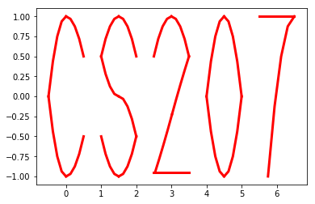
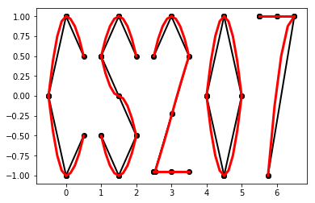

Additional features
===================

Root finding
------------

Optimization
------------

Quadratic Splines
-----------------

Background
~~~~~~~~~~

| The ``DeriveAlive`` package can be used to calculate quadratic splines
  since it automatically returns the first derivative of a function at a
  given point.

| We aim to construct a piecewise quadratic spline :math:`s(x)` using
  :math:`N` equally-sized intervals over an interval for :math:`f(x)`.
  Define :math:`h=1/N`, and let :math:`s_{k}(x)` be the spline over the
  range :math:`[kh,(k+1)h]` for :math:`k=0,1,\ldots,N-1`. Each
  :math:`s_k(x)=a_kx^2+b_kx+c_k` is a quadratic, and hence the spline
  has :math:`3N` degrees of freedom in total.
  
| The spline coefficients satisfy the following constraints:

-  Each :math:`s_k(x)` should match the function values at both of its
   endpoints, so that :math:`s_k(kh)=f(kh)` and
   :math:`s_k( (k+1)h) =f( (k+1)h)`. (Provides :math:`2N` constraints.)

-  At each interior boundary, the spline should be differentiable, so
   that :math:`s_{k-1}(kh)= s_k(kh)` for :math:`k=1,\ldots,N-1`.
   (Provides :math:`N-1` constraints.)

-  Since :math:`f'(x+1)=10f'(x)`, let :math:`s'_{N-1}(1) = 10s'_0(0)`.
   (Provides :math:`1` constraint.)

Since there are :math:`3N` constraints for :math:`3N` degrees of
freedom, there is a unique solution.

Implementation
~~~~~~~~~~~~~~

..automodule:: spline

-  Methods

   -  ``quad_spline_coeff``: calculate the coefficients of quadratic
      splines

      -  input:

         -  ``f``: function of interest

         -  ``xMin``: left endpoint of the :math:`x` interval

         -  ``xMax``: right endpoint of the :math:`x` interval

         -  ``nIntervals``: number of intervals that you want to slice
            the original function

      -  return:

         -  ``y``: the right hand side of :math:`Ax=y`

         -  ``A``: the sqaure matrix in the left hand side of
            :math:`Ax=y`

         -  ``coeffs``: coefficients of :math:`a_i, b_i, c_i`

         -  ``ks``: points of interest in the :math:`x` interval as
            ``DeriveAlive`` objects

   -  ``spline_points``: get the coordinates of points on the
      corresponding splines

      -  input:

         -  ``f``: function of interest

         -  ``coeffs``: coefficients of :math:`a_i, b_i, c_i`

         -  ``ks``: points of interest in the :math:`x` interval as
            ``DeriveAlive`` objects

         -  ``nSplinePoints``: number of points to draw each spline

      -  return:

         -  ``spline_points``: a list of spline points :math:`(x,y)` on
            each :math:`s_i`

   -  ``quad_spline_plot``: plot the original function and the
      corresponding splines

      -  input:

         -  ``f``: function of interest

         -  ``coeffs``: coefficients of :math:`a_i, b_i, c_i`

         -  ``ks``: points of interest in the :math:`x` interval as
            ``DeriveAlive`` objects

         -  ``nSplinePoints``: number of points to draw each spline

      -  return:

         -  ``fig``: the plot of :math:`f(x)` and splines

   -  ``spline_error``: calculate the average absolute error of the
      spline and the original function at one point

      -  input:

         -  ``f``: function of interest

         -  ``spline_points``: a list of spline points :math:`(x,y)` on
            each :math:`s_i`

      -  return:

         -  ``error``: average absolute error of the spline and the
            original function on one given interval

-  External dependencies

   -  ``DeriveAlive``

   -  ``NumPy``

   -  ``matplotlib.pyplot``

Demo
~~~~

::

        >>> import spline as sp
        >>> import numpy as np
        >>> import matplotlib.pyplot as plt

Plot the quadratic spline of :math:`f_1(x) = 10^x, x \in [-1, 1]` with
10 intervals.

::

        >>> def f1(var):
                return 10**var

        >>> xMin1 = -1
        >>> xMax1 = 1
        >>> nIntervals1 = 10
        >>> nSplinePoints1 = 5

        >>> y1, A1, coeffs1, ks1 = sp.quad_spline_coeff(f1, xMin1, xMax1, nIntervals1)
        >>> fig1 = sp.quad_spline_plot(f1, coeffs1, ks1, nSplinePoints1)
        >>> spline_points1 = sp.spline_points(f1, coeffs1, ks1, nSplinePoints1)
        >>> sp.spline_error(f1, spline_points1)
        0.0038642295476342416

        >>> fig1

.. image:: images/7_3_3_1.png
  :width: 600       

Plot the quadratic spline of :math:`f_2(x) = x^3, x \in [-1, 1]` with 10 intervals.

::

        >>> def f2(var):
                return var**3

        >>> xMin2 = -1
        >>> xMax2 = 1
        >>> nIntervals2 = 10
        >>> nSplinePoints2 = 5

        >>> y2, A2, coeffs2, ks2 = sp.quad_spline_coeff(f2, xMin2, xMax2, nIntervals2)
        >>> fig2 = sp.quad_spline_plot(f2, coeffs2, ks2, nSplinePoints2)
        >>> spline_points2 = sp.spline_points(f2, coeffs2, ks2, nSplinePoints2)
        >>> sp.spline_error(f2, spline_points2)
        0.0074670329670330216

        >>> fig2

Plot the quadratic spline of :math:`f_3(x) = \sin(x), x \in [-1,1]` and :math:`x \in [-\pi, \pi]` with 5 intervals and 10 intervals.

::

        >>> def f3(var):
                return np.sin(var)

        >>> xMin3 = -1
        >>> xMax3 = 1
        >>> nIntervals3 = 5
        >>> nSplinePoints3 = 5

        >>> y3, A3, coeffs3, ks3 = sp.quad_spline_coeff(f3, xMin3, xMax3, nIntervals3)
        >>> fig3 = sp.quad_spline_plot(f3, coeffs3, ks3, nSplinePoints3)
        >>> spline_points3 = sp.spline_points(f3, coeffs3, ks3, nSplinePoints3)
        >>> sp.spline_error(f3, spline_points3)
        0.015578205778177232

        >>> fig3

::

        >>> xMin4 = -1
        >>> xMax4 = 1
        >>> nIntervals4 = 10
        >>> nSplinePoints4 = 5

        >>> y4, A4, coeffs4, ks4 = sp.quad_spline_coeff(f3, xMin4, xMax4, nIntervals4)
        >>> fig4 = sp.quad_spline_plot(f3, coeffs4, ks4, nSplinePoints4)
        >>> spline_points4 = sp.spline_points(f3, coeffs4, ks4, nSplinePoints4)
        >>> sp.spline_error(f3, spline_points4)
        0.0034954287455489196

        >>> fig4

.. note:: We can see that the quadratic splines do not work that well with linear-ish functions. While adding more intervals may help to make the approximated splines better.

Here we demonstrate that the more intervals will make the splines approximations better using a :math:`log-log` plot of the absolute average error with respect to :math: \frac{1}{N}` with :math:`f(x) = 10^x, x \in [-\pi, \pi]` at intervals from 5 to 100.

::

        >>> def f(var):
                return 10 ** var

        >>> xMin = -sp.np.pi
        >>> xMax = sp.np.pi
        >>> nIntervalsList = sp.np.arange(1, 50, 1)
        >>> nSplinePoints = 10
        >>> squaredErrorList = []

        >>> for nIntervals in nIntervalsList:
                y, A, coeffs, ks = sp.quad_spline_coeff(f, xMin, xMax, nIntervals)
                spline_points = sp.spline_points(f, coeffs, ks, nSplinePoints)
                error = sp.spline_error(f, spline_points)
                squaredErrorList.append(error)
    
        >>> plt.figure()
    
        >>> coefficients = np.polyfit(np.log10(2*np.pi/nIntervalsList), np.log10(squaredErrorList), 1)
        >>> polynomial = np.poly1d(coefficients)
        >>> ys = polynomial(np.log10(2*np.pi/nIntervalsList))
        >>> plt.plot(np.log10(2*np.pi/nIntervalsList), ys, label='linear fit')
        >>> plt.plot(np.log10(2*np.pi/nIntervalsList), np.log10(squaredErrorList), label='actual error plot')
        >>> plt.xlabel(r'$\log(1/N)$')
        >>> plt.ylabel(r'$\log(average error)$')
        >>> plt.legend()
        >>> plt.title('loglog plot of 1/N vs. average error')
        >>> plt.show()

::

        >>> beta, alpha = coefficients[0], 10**coefficients[1]
        >>> beta, alpha
        (2.2462166565957835, 11.414027075895813)

.. note:: We can see in the :math:`log-log` plot that the log of absolute average error is proportional to the log of :math:`\frac{1}{N}`, i.e. :math:`E_{1/N} \approx 11.4(\dfrac{1}{N})^{2.25}`. 

Drawing with Splines
~~~~~~~~~~~~~~~~~~~~

| This graph is shipped within ``DeriveAlive`` package as a surprise.

| We want to draw a graph based on the follow 20 functions.

- :math:`f_1(x) = \frac{-1}{0.5^2} x^2 + 1, x \in [-0.5, 0]`

- :math:`f_2(x) = \frac{1}{0.5^2} x^2 - 1, x \in [-0.5, 0]`

- :math:`f_3(x) = \frac{-1}{0.5} x^2 + 1, x \in [0, 0.5]`

- :math:`f_4(x) = \frac{1}{0.5} x^2 - 1, x \in [0, 0.5]`

- :math:`f_6(x) = \frac{-1}{0.5} (x-1.5)^2 + 1, x \in [1, 1.5]`

- :math:`f_7(x) = \frac{1}{0.5} (x-1.5)^2 - 1, x \in [1, 1.5]`

- :math:`f_8(x) = \frac{-1}{0.5} (x-1.5)^2, x \in [1.5, 2]`

- :math:`f_9(x) = \frac{-1}{0.5} (x-1.5)^2 + 1, x \in [1.5, 2]`

- :math:`f_{10}(x) = \frac{1}{0.5} (x-1.5)^2 - 1, x \in [1.5, 2]`

- :math:`f_{11}(x) = \frac{-1}{0.5} (x-3)^2 + 1, x \in [2.5, 3]`

- :math:`f_{12}(x) = \frac{-1}{0.5} (x-3)^2 + 1, x \in [3, 3.5]`

- :math:`f_{13}(x) = 1.5x - 4.75, x \in [2.5, 3.5]`

- :math:`f_{14}(x) = -1, x \in [2.5, 3.5]`

- :math:`f_{15}(x) = \frac{-1}{0.5^2} (x-4.5)^2 + 1, x \in [4, 4,5]`

- :math:`f_{16}(x) = \frac{1}{0.5^2} (x-4.5)^2 - 1, x \in [4, 4,5]`

- :math:`f_{17}(x) = \frac{-1}{0.5^2} (x-4.5)^2 + 1, x \in [4, 4,5]`

- :math:`f_{18}(x) = \frac{1}{0.5^2} (x-4.5)^2 - 1, x \in [4.5, 5]`

- :math:`f_{19}(x) = 1, x \in [5.5, 6.5]`

- :math:`f_{20}(x) = \frac{-1}{(-0.75)^2} (x-6.5)^2 + 1, x \in [5.75, 6.5]`

::

  >>> import surprise
  # We first draw out the start and end points of each function
  >>> surprise.drawPoints()

::

  # Then we use the spline suite to draw quadratic splines based on the two points
  >>> surprise.drawSpline()

::

  >>> surprise.drawTogether()

